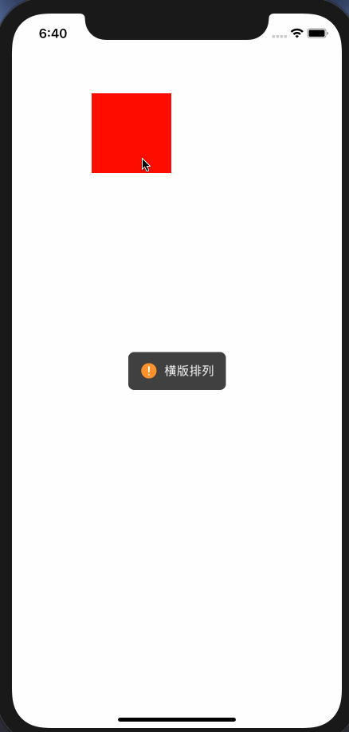

# HDHUD


### [Document for English](#english)

### [中文文档](#chinese)

<span id = "english"></span>

## Screenshots




## 2. Features

Simple and easy to use, through different parameters to achieve different display effects

* Plain text display
* With icon display, the position of icon and picture supports customization
* Progress bar display
* loading display
* Adaptive text size

### Support the use of `cocoapods` integration

```
pod "HDHUD"
```

## 3. Display and use

### 3.1, Plain text HUD

Text support with icon display and plain text display

You can use `show` for plain text display

```
HDHUD.show("plain text display")
```

You can also display text with icon through parameter settings

```
HDHUD.show("icon display",hudType: .warn)
```

`Icon` has five performance styles by default, you can modify the displayed image by setting the parameter `warnImage`

```
public enum HDHUDType {
    case none
    case warn
    case error
    case success
    case loading
}
```

The default is that the icon is on the left and the text is on the right. You can change the layout direction of icon and text

```
HDHUD.show("Vertical arrangement",hudType: .warn, direction: .vertical)
```

The content is not necessary. If you only want to show loading and other styles with only `icon`, then you can use

```
HDHUD.show(hudType: .loading)
```

### 3.2, progress HUD

The progress bar `hud` needs to update the progress all the time, so it optimizes the progress bar, use `showProgress` to display, and use `HDHUD.hide()` to close it when appropriate

```
HDHUD.showProgress(0.3, direction: .vertical)
HDHUD.showProgress(0.5, direction: .vertical)
HDHUD.showProgress(0.9, direction: .vertical)
//shut down
HDHUD.hide()
```

### 3.3, display custom view

Reserve the function of displaying custom views, you can display your own views

```
HDHUD.show(view: customView)
```

### 3.4, general settings

More parameters can be set for personalized use

* `hudType` icon type
* `duration` specifies the time when the HUD is automatically turned off, `-1` means not to turn off automatically
* `superView` specifies the upper view of the HUD, the default is the current window
* `userInteractionOnUnderlyingViewsEnabled`  whether the bottom view responds when the hud pops up
* `completion` callback after the HUD is automatically closed, if `duration` is set to -1, it will not be called

```
HDHUD.show("Text Information", hudType: .warn, direction: .vertical, duration: 3.0, superView: self.view, userInteractionOnUnderlyingViewsEnabled: true) {
       //Automatically closed callback
}
```

You can modify the global pop-up window display through other custom settings. For example, set the background color of the HUD

```
HDHUD.warnImage = UIImage(contentsOfFile: UIImageHDBoundle(named: "ic_warning@3x.png"))
HDHUD.warnImageSize = CGSize(width: 24, height: 24)
HDHUD.errorImage = UIImage(contentsOfFile: UIImageHDBoundle(named: "ic_error@3x.png"))
HDHUD.errorImageSize = CGSize(width: 24, height: 24)
HDHUD.successImage = UIImage(contentsOfFile: UIImageHDBoundle(named: "ic_success@3x.png"))
HDHUD.successImageSize = CGSize(width: 24, height: 24)
HDHUD.loadingImageURL = URL(fileURLWithPath: UIImageHDBoundle(named: "loading.gif"))
HDHUD.loadingImageSize = CGSize(width: 48, height: 48)
HDHUD.backgroundColor = UIColor(hexValue: 0x000000, alpha: 0.8)
HDHUD.textColor = UIColor(hexValue: 0xFFFFFF)
HDHUD.textFont = UIFont.systemFont(ofSize: 16)
HDHUD.contentOffset = CGPoint.zero
HDHUD.progressTintColor = UIColor(hexValue: 0xFF8F0C)
HDHUD.trackTintColor = UIColor(hexValue: 0xFFFFFF)
```

<span id = "chinese"></span>

## 一、效果图


## 二、特点

简单易用，通过不同的参数，实现不同的展示效果

* 纯文本展示
* 带icon展示，icon和图片的位置支持自定义
* 进度条展示
* loading展示
* 自适应文本大小

### 支持使用`cocoapods`集成

```
pod "HDHUD"
```

## 三、展示使用

### 3.1、普通文本HUD

文本支持带icon展示和纯文本展示

您可以使用`show`进行纯文本展示

```
HDHUD.show("纯文本展示")
```

也可以通过参数设置进行带icon的文本展示

```
HDHUD.show("icon展示",hudType: .warn)
```

`icon`默认有五种表现风格，你可以通过设置对应的`warnImage`去修改展示的图片

```
public enum HDHUDType {
    case none
    case warn
    case error
    case success
    case loading
}
```

默认为icon在左侧，文本在右侧，您可以指定icon和文本的排列方式

```
HDHUD.show("竖版排列",hudType: .warn, direction: .vertical)
```

内容不是必须项，如果你只想展示loading等只有`icon`的样式，那么可以使用

```
HDHUD.show(hudType: .loading)
```

### 3.2、进度HUD

进度条`hud`因为需要一直更新进度，所以对专门对进度条进行了优化，使用`showProgress`进行展示，在合适时候使用`HDHUD.hide()`进行关闭

```
HDHUD.showProgress(0.3, direction: .vertical)
HDHUD.showProgress(0.5, direction: .vertical)
HDHUD.showProgress(0.9, direction: .vertical)
//关闭
HDHUD.hide()
```

### 3.3、展示自定义view

预留了展示自定义view的功能，可以展示自己写的view

```
HDHUD.show(view: customView)
```

### 3.4、通用设置

可以设置更多参数进行个性化使用

* `hudType` icon类型
* `duration`指定HUD的自动关闭的时间， `-1`为不自动关闭
* `superView` 指定HUD的上层View，默认为当前的window
* `userInteractionOnUnderlyingViewsEnabled` HUD弹出之后，底部view是否响应点击
* `completion` 自动关闭之后的回调，如果`duration`设置为-1，不会进行调用

```
HDHUD.show("文本信息", hudType: .warn, direction: .vertical, duration: 3.0, superView: self.view, userInteractionOnUnderlyingViewsEnabled: true) {
       //自动关闭的回调
}
```

可以通过其他自定义设置进行全局的弹窗显示修改，例如设置HUD的内容背景色等

```
HDHUD.warnImage = UIImage(contentsOfFile: UIImageHDBoundle(named: "ic_warning@3x.png"))
HDHUD.warnImageSize = CGSize(width: 24, height: 24)
HDHUD.errorImage = UIImage(contentsOfFile: UIImageHDBoundle(named: "ic_error@3x.png"))
HDHUD.errorImageSize = CGSize(width: 24, height: 24)
HDHUD.successImage = UIImage(contentsOfFile: UIImageHDBoundle(named: "ic_success@3x.png"))
HDHUD.successImageSize = CGSize(width: 24, height: 24)
HDHUD.loadingImageURL = URL(fileURLWithPath: UIImageHDBoundle(named: "loading.gif"))
HDHUD.loadingImageSize = CGSize(width: 48, height: 48)
HDHUD.backgroundColor = UIColor(hexValue: 0x000000, alpha: 0.8)
HDHUD.textColor = UIColor(hexValue: 0xFFFFFF)
HDHUD.textFont = UIFont.systemFont(ofSize: 16)
HDHUD.contentOffset = CGPoint.zero
HDHUD.progressTintColor = UIColor(hexValue: 0xFF8F0C)
HDHUD.trackTintColor = UIColor(hexValue: 0xFFFFFF)
```
