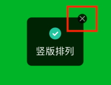

# HDHUD


## [中文文档](https://blog.dongge.org/1396.html)

## [V3版本文档](./README_3.0.md)


## Preview

![demo\_v4.gif][1]

## Installation

You can install via `cocoapods`:

```
pod "HDHUD"
```

A simple Toast implementation, wrapped in Swift. Version 4.0 is inspired by `ElementUI` and introduces a **sequential display mode**, allowing multiple messages to be shown flexibly. Window management has been optimized compared to version 3.0, improving performance, and the library does not depend on any other third-party frameworks.

## Features

* Simple to use and high-performance
* Supports both sequential and single-message display, with content auto-sizing
* Flexible configuration and UI customization
* Lightweight and dependency-free

## Displaying a Toast

```swift
// Plain text
HDHUD.show("Simple text message")

// Only icon
HDHUD.show(icon: .loading)

// Text with icon
HDHUD.show("Error message", icon: .error)

// Progress display
let task = HDHUD.show(progress: 0.3)
// Update progress
task.progress = task.progress + 0.3
```

## Hiding HUDs

```swift
// Hide all
HDHUD.hide()

// Hide a specific message
let task = HDHUD.show("Vertical arrangement")
HDHUD.hide(task: task)
```

## Switching to Single-Message Display

By default, messages are displayed sequentially. If you prefer the traditional single-message style, set:

```swift
HDHUD.displayType = .single
```

## Additional Configuration Options

```swift
open class HDHUD {
    public static var displayPosition: HDHUDDisplayPosition = .top
    public static var displayType: HDHUDDisplayTypee = .sequence

    /// Images
    public static var warnImage = UIImageHDBundle(named: "ic_warning")
    public static var warnImageSize = CGSize(width: 24, height: 24)
    public static var errorImage = UIImageHDBundle(named: "ic_error")
    public static var errorImageSize = CGSize(width: 24, height: 24)
    public static var successImage = UIImageHDBundle(named: "ic_success")
    public static var successImageSize = CGSize(width: 24, height: 24)
    public static var loadingImage = getLoadingImage()
    public static var loadingImageSize = CGSize(width: 18, height: 18)

    /// Colors and text
    public static var contentBackgroundColor = UIColor(red: 0, green: 0, blue: 0, alpha: 0.8)
    public static var backgroundColor = UIColor(red: 0, green: 0, blue: 0, alpha: 0.2)
    public static var textColor = UIColor(red: 1.0, green: 1.0, blue: 1.0, alpha: 1.0)
    public static var textFont = UIFont.systemFont(ofSize: 16)
    public static var contentOffset = CGPoint.zero
    public static var progressTintColor = UIColor(red: 1.0, green: 0.6, blue: 0.0, alpha: 1.0)
    public static var trackTintColor = UIColor(red: 1.0, green: 1.0, blue: 1.0, alpha: 1.0)
    public static var isShowCloseButton = false
    public static var isUserInteractionEnabled = false
}
```

## Close Button



For scenarios with potentially long waits, when `duration` is set to `-1`, you can enable `isShowCloseButton` and `isUserInteractionEnabled`. This will display a close button at the top-right corner of the popup, allowing users to manually dismiss it.

## Project

GitHub: [https://github.com/DamonHu/HDHUD](https://github.com/DamonHu/HDHUD)

[1]: https://blog.dongge.org/usr/uploads/2025/10/3244800052.gif

